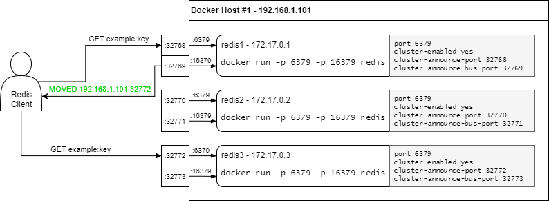

# Redis5 配置及优化总结

1. 配置文件中单元大小的解释，不区分大小写

   ```
   # Note on units: when memory size is needed, it is possible to specify
   # it in the usual form of 1k 5GB 4M and so forth:
   #
   # 1k => 1000 bytes
   # 1kb => 1024 bytes
   # 1m => 1000000 bytes
   # 1mb => 1024*1024 bytes
   # 1g => 1000000000 bytes
   # 1gb => 1024*1024*1024 bytes
   #
   # units are case insensitive so 1GB 1Gb 1gB are all the same.
   ```

2. 配置模板，针对个性化配置

   ```
   # 假如说你有一个可用于所有的 redis server 的标准配置模板，
   # 但针对某些 server 又需要一些个性化的设置，
   # 你可以使用 include 来包含一些其他的配置文件，这对你来说是非常有用的。
   # include /path/to/local.conf
   # include /path/to/other.conf
   ```

3. 加载模块

   ```
   模块有两种加载方式，
   一是在配置文件redis.conf中使用loadmodule /path/to/mymodule.so在Redis启动时加载。
   另一种方式在运行时使用命令MODULE LOAD /path/to/mymodule.so加载。加载的模块可以使用命令MODULE LIST查看，使用MODULE UNLOAD mymodule卸载。
   
   在载入的模块的时候可以传入参数，如：loadmodule mymodule.so foo bar 123456，参数会被传入模块的OnLoad方法中。
   # loadmodule /path/to/my_module.so
   # loadmodule /path/to/other_module.so
   ```

4. 安全相关bind/protected-mode

   ```
   默认设置yes， 禁止公网访问redis cache，加强redis安全
   它启用的条件，有两个：
   1） 没有bind IP
   2） 没有设置访问密码
   配置redis的sentinel集群时，哨兵之间不能通信，不能进行主结节客观下线的判断，以及failover，解决呢办法sentinel.conf中加入了protected-mode no
   详情说明可以见：acceptCommonHandler源码说明
   
   关于bind设置说明
   bind配置了什么ip，别人就得访问bind里面配置的ip才访问到redis服务。
   bind配置的ip必须是本机的ip，一台机器可以对应多个ip地址，配置非本机的ip地址会报错，如果配置为
   bind 127.0.0.1 表明只能本机访问，
   bind 0.0.0.0等价于 不配置 bind 即注释掉bind
   
   想限制只有指定的主机可以连接到redis中，我们只能通过防火墙来控制，而不能通过redis中的bind参数来限制
   很容易让人误解的一个配置
   ```

5. 访问端口

   ```
   port 6379 默认值 选择这个端口号完全就是作者为了diss一个妹子，程序员真的是一个很屌丝的职业。。。
   详情可见：http://oldblog.antirez.com/post/redis-as-LRU-cache.html
   ```

6. TCP 监听的最大容纳数量

   ```
   tcp-backlog 511
   //在高并发的环境下，你需要把这个值调高以避免客户端连接缓慢的问题。
   //值的大小是受somaxconn影响，调大需要修改内核的somaxconn值，实际应该是tcp过程中accept queue队列的最大值
   ```

7. unix socket方式来接收请求

   ```
   # unixsocket /tmp/redis.sock
   # unixsocketperm 700
   //通过unixsocket配置项来指定unix socket文件的路径，并通过unixsocketperm来指定文件的权限
   ```

8. redis-client连接断开时间

   ```
   timeout 0
   redis-client一直没有请求发向server端，那么server端有权主动关闭这个连接，可以通过timeout来设置“空闲超时时限”，0表示永不关闭，推荐配置为300
   ```

9. tcp-keepalive 300 //tcp保持连接的时长

10. 守护进程

    ```
    daemonize no 默认为no  //进程pid号写入至redis.conf选项pidfile设置的文件中
    ```

11. supervised no

    ```
    通过其他的守护进程upstart和systemd管理Redis守护进程，这个参数是和具体的操作系统相关的。
    ```

12. pidfile /var/run/redis_6379.pid

    ```
    配置pid文件路径。当redis以守护模式启动时，如果没有配置pidfile，pidfile默认值是/var/run/redis.pid
    ```

13. 日志等级/路径

    ```
    debug（记录大量日志信息，适用于开发、测试阶段）；  verbose（较多日志信息）；  notice（适量日志信息，使用于生产环境）；warning（仅有部分重要、关键信息才会被记录）。
    日志文件的位置，当指定为空字符串时，为标准输出，如果redis已守护进程模式运行，那么日志将会输出到  /dev/null
    #syslog-enabled设置为yes会把日志输出到系统日志，默认是no
    #syslog-enabled no
    #指定syslog的标示符，如果syslog-enabled是no，则这个选项无效。
    # syslog-ident redis
    syslog-facility local0 若启用日志记录，则需要设置日志facility，可取值范围为local0~local7，表示不同的日志级别
    ```

14. databases 16 //默认数据库的数量

1. always-show-logo yes //设置是否在控制台显示redis logo图标

2. 快照备份相关设置

   ```
   save 900 1
   save 300 10
   save 60 10000
   save <seconds> <changes>
   //指定在多长时间内，有多少次更新操作，就将数据同步到数据文件，可以多个条件配合
   stop-writes-on-bgsave-error yes //后台存储存储发生错误时禁止写入，默认为yes
   rdbcompression yes //启动rdb文件压缩，耗费CPU资源，默认为yes，建议开启，压缩率高
   rdbchecksum yes  //对rdb数据进行校验，耗费CPU资源，默认为yes
   dbfilename dump.rdb //rdb文件名称
   dir ./  //路径
   ```

1. 主从复制相关配置

   ```
   # replicaof <masterip> <masterport> 主节点ip和端口
   # masterauth <master-password>  访问密码
   replica-serve-stale-data yes
   replica-serve-stale-data yes，即使主从断了，从依然响应客户端的请求。
   replica-serve-stale-data no，主从断开了，则从会提示客户端"SYNC with master in progress"，但有些指令还可以使用 INFO, replicaOF, AUTH, PING, SHUTDOWN, REPLCONF, ROLE, CONFIG,SUBSCRIBE, UNSUBSCRIBE, PSUBSCRIBE, PUNSUBSCRIBE, PUBLISH, PUBSUB, COMMAND, POST, HOST: and LATENCY
   replica-read-only yes //配置从节点是否只读
   repl-diskless-sync no //以往主从复制是生成rdb文件,然后传输给从节点,配置成yes后可以不进行写磁盘直接进行复制,适用于磁盘慢网络带宽大的场景
   repl-diskless-sync-delay 5//让主节点等待更多从节点来同时复制,设置过小,复制时来的从节点必须等待下一次rdb transfer 单位秒,如果小于0则启动失败
   # repl-ping-replica-period 10 //从发给主的心跳周期,如果小于0则启动失败
   # repl-timeout 60  多少秒没收到心跳的响应认为超时,最好设置的比 repl-ping-slave-period/repl-ping-replica-period大如果小于0则启动失败
   repl-disable-tcp-nodelay no  //如果设置yes,会导致主从同步有40ms滞后(linux默认),如果no,则主从同步更及时
   # repl-backlog-size 1mb 复制积压大小,解决复制过程中从节点重连后不需要full sync,这个值越大,那么从节点断开到重连的时间就可以更长
   # repl-backlog-ttl 3600 //复制积压的生命期,超过多长时间从节点还没重连,则释放内存
   replica-priority 100 //给众多的从Redis设置优先级，在主Redis持续工作不正常的情况，优先级高的从Redis将会升级为主Redis。而编号越小，优先级越高。 比如一个主Redis有三个从Redis，优先级编号分别为10、100、25，那么编号为10的从Redis将会被首先选中升级为主Redis。 当优先级被设置为0时，这个从Redis将永远也不会被选中,默认的优先级为100
   # min-replicas-to-write 3
   # min-replicas-max-lag 10
   //假如有大于等于3个从Redis的连接延迟大于10秒，那么主Redis就不再接受外部的写请求。 上述两个配置中有一个被置为0，则这个特性将被关闭。默认情况下min-slaves-to-write为0，而min-slaves-max-lag为10
   
   # replica-announce-ip 5.5.5.5
   # replica-announce-port 1234
   Redis master 可以通过不同方式列出连接上来的 replicas 节点的地址和端口。 如 Redis Sentinel 等会使用 “INFO replication” 命令来获取 replica 实例信息。 master 的 “ROLE“ 命令也会提供此信息。
   
   这个信息一般来说是通过 replica 节点通过一下方式获取然后报告上来的：
   
   IP：通过自动识别连接到 Socket 的信息自动获取
   Port：一般来说这个值就是 replicas 节点用来接受客户端的连接的监听端口
   但是，若启用了端口转发或者 NAT，可能需要其他地址和端口才能连接到 replicas 节点。 这种情况下，需要设置这两个选项，这样 replicas 就会用这两个选项设置的值覆盖默认行为获取的值，然后报告给 master 节点。 根据实际情况，你可以只设置其中某个选项，而不用两个选项都设置。
   ```

1. 安全

   ```
   # requirepass foobared
   设置Redis连接密码，如果配置了连接密码，客户端在连接Redis时需要通过AUTH <password>命令提供密码，默认关闭
   ps：由于 Redis 非常快，外部用户若进行暴力破解，每秒能尝试超过 150k 个密码。因此你需要使用强度非常高的密码才能保证密码不容易被暴力破解掉。
   rename-command CONFIG b840fc02d524045429941cc15f59e41cb7be6c52
   在共享环境下，可以通过 rename-command 命令将一些危险的命令进行重命名。 如上所示将 CONFIG 命令重命名为难以猜测的命令。
   可以通过将命令重命名为空字符串从而将其完全 ”kill“ 掉，如
   rename-command CONFIG ""
   rename-command 命令会被记录到日志和 AOF 文件中或者传输到 replicas 节点，而这可能会是一个安全问题。
   ```

1. 客户端数量

   ```
   # maxclients 10000
    设置同一时间最大客户端连接数，默认无限制，Redis可以同时打开的客户端连接数为Redis进程可以打开的最大文件描述符数，如果设置 maxclients 0，表示不作限制。当客户端连接数到达限制时，Redis会关闭新的连接并向客户端返回max number of clients reached错误信息，上限值和系统的句柄连接数相关。
   ```

2. 内存设置相关

   ```
    # maxmemory <bytes>
    // 指定Redis最大内存限制，Redis新的vm机制，会把Key存放内存，Value会存放在swap区,意义不大。
    redis内存管理策略，默认为noeviction
            1.volatile-lru(least recently used):最近最少使用算法，从设置了过期时间的键中选择空转时间最长的键值对清除掉；
   
           2.volatile-lfu(least frequently used):最近最不经常使用算法，从设置了过期时间的键中选择某段时间之内使用频次最小的键值对清除掉；
   
           3.volatile-ttl:从设置了过期时间的键中选择过期时间最早的键值对清除；
   
           4.volatile-random:从设置了过期时间的键中，随机选择键进行清除；
   
           5.allkeys-lru:最近最少使用算法，从所有的键中选择空转时间最长的键值对清除；
   
           6.allkeys-lfu:最近最不经常使用算法，从所有的键中选择某段时间之内使用频次最少的键值对清除；
   
           7.allkeys-random:所有的键中，随机选择键进行删除；
   
           8.noeviction:不做任何的清理工作，在redis的内存超过限制之后，所有的写入操作都会返回错误；但是读操作都能正常的进行;
           
   # maxmemory-policy noeviction
   
   maxmemory-samples   5个key作为样本池进行抽样清理，默认值5为最优
   # replica-ignore-maxmemory yes replica 节点会忽略 maxmemory 设置
   ```

1. 惰性删除

   ```
   lazyfree-lazy-eviction no
   lazyfree-lazy-expire no
   lazyfree-lazy-server-del no
   replica-lazy-flush no
   默认设置为no，个人感觉应该全部设置yes，代码会根据实际情况进行判断，是否进行惰性删除。
   ```

2. aof持久化配置

   ```
   appendonly no
   appendfilename "appendonly.aof"
   
   # appendfsync always
   appendfsync everysec
   # appendfsync no
   
   1、appendfsync no 
   当设置appendfsync为no的时候，Redis不会主动调用fsync去将AOF日志内容同步到磁盘，所以这一切就完全依赖于操作系统的调试了。对大多数Linux操作系统，是每30秒进行一次fsync，将缓冲区中的数据写到磁盘上。 
   2、appendfsync everysec 
   当设置appendfsync为everysec的时候，Redis会默认每隔一秒进行一次fsync调用，将缓冲区中的数据写到磁盘。但是当这一 次的fsync调用时长超过1秒时。Redis会采取延迟fsync的策略，再等一秒钟。也就是在两秒后再进行fsync，这一次的fsync就不管会执行多长时间都会进行。这时候由于在fsync时文件描述符会被阻塞，所以当前的写操作就会阻塞。 
   所以，结论就是：在绝大多数情况下，Redis会每隔一秒进行一次fsync。在最坏的情况下，两秒钟会进行一次fsync操作，掉数据也就1-2秒
   这一操作在大多数数据库系统中被称为group commit，就是组合多次写操作的数据，一次性将日志写到磁盘。 
   3、appednfsync always 
   当设置appendfsync为always时，每一次写操作都会调用一次fsync，这时数据是最安全的，当然，由于每次都会执行fsync，所以其性能也会受到影响。
   ///////////////////////////////
   no-appendfsync-on-rewrite no
   bgrewriteaof机制，在一个子进程中进行aof的重写，从而不阻塞主进程对其余命令的处理，同时解决了aof文件过大问题。
   现在问题出现了，同时在执行bgrewriteaof操作和主进程写aof文件的操作，两者都会操作磁盘，而bgrewriteaof往往会涉及大量磁盘操作，这样就会造成主进程在写aof文件的时候出现阻塞的情形，现在no-appendfsync-on-rewrite参数出场了。如果该参数设置为no，是最安全的方式，不会丢失数据，但是要忍受阻塞的问题。如果设置为yes呢？这就相当于将appendfsync设置为no，这说明并没有执行磁盘操作，只是写入了缓冲区，因此这样并不会造成阻塞（因为没有竞争磁盘），但是如果这个时候redis挂掉，就会丢失数据。丢失多少数据呢？在linux的操作系统的默认设置下，最多会丢失30s的数据。
   
   因此，如果应用系统无法忍受延迟，而可以容忍少量的数据丢失，则设置为yes。如果应用系统无法忍受数据丢失，则设置为no。
   
   /////////////// rewrite执行临界值
   auto-aof-rewrite-percentage 100
   auto-aof-rewrite-min-size 64mb
   自动重写 append only file 选项。 当 AOF 文件增长到一定比例后，Redis 可以自动通过隐式调用 BGREWRITEAOF 命令来重写 AOF 文件。
   Redis 会记录上一次 rewrite 的 AOF 文件大小（若从未进行 rewrite，Redis 会使用启动时的 AOF 文件大小）作为基准大小。
   Redis 会比较当前大小和基准大小，若当前大小大于一定比例则触发 rewrite。 为了防止增长比例到了但是总数据量还是非常小的情况就触发 rewrite，你还需要指定一个 AOF rewritten 的最小大小。
   通过将 auto-aof-rewrite-percentage 设置为 0 可以禁用此功能。
   
   /////////aof文件不完整
   aof-load-truncated yes
   当 Redis 启动时可能会发现 AOF 文件被截断了（不完整），这可能是由于系统崩溃了， 特别是 ext4 没有以 data=ordered 选项挂载的情况（在 Redis 崩溃而系统正常的情况下不会发生截断）。
   当这种情况发生时，Redis 可以选择终止进程，或者加载 AOF 文件上尽可能多的数据（目前的默认行为）。
   当 aof-load-truncated 设置为 yes， Redis 服务端在启动的时候发现加载的 AOF 文件是被截断的会发送一条日志来通知客户。 若 aof-load-truncated 设置为 no，服务端会以错误形式终止进程并拒绝启动。 这是需要用户在重启服务前使用 "redis-check-aof" 工具来修复 AOF 文件。
   
   aof-use-rdb-preamble yes //aof,rdb混合持久化
   ```

1. lua脚本

   ```
   lua-time-limit 5000
   此选项用于控制 Lua 脚本的最长执行时间，单位为毫秒。
   当 Lua 脚本的执行时间超出限制后，Redis 会在写入相关日志，并且向客户端返回出错。
   ```

1. redis cluster配置

   ```
   # cluster-enabled yes
   如果配置yes则开启集群功能，此redis实例作为集群的一个节点，否则，它是一个普通的单一的redis实例。
   
   # cluster-config-file nodes-6379.conf
   集群配置文件，但是此配置文件不能人工编辑，它是集群节点自动维护的文件，主要用于记录集群中有哪些节点、他们的状态以及一些持久化参数等，方便在重启时恢复这些状态。通常是在收到请求之后这个文件就会被更新。
   
   # cluster-node-timeout 15000
   这是集群中的节点能够失联的最大时间，超过这个时间，该节点就会被认为故障。如果主节点超过这个时间还是不可达，则用它的从节点将启动故障迁移，升级成主节点。注意，任何一个节点在这个时间之内如果还是没有连上大部分的主节点，则此节点将停止接收任何请求。一般设置为15秒即可。
   
   # cluster-replica-validity-factor 10
   如果数据太旧，集群中的不可用master的slave节点会避免成为备用master。如果slave和master失联时间超过:(node-timeout * slave-validity-factor) + repl-ping-slave-period则不会被提升为master。
   如node-timeout为30秒，slave-validity-factor为10, 默认default repl-ping-slave-period为10秒,失联时间超过310秒slave就不会成为master。
   较大的slave-validity-factor值可能允许包含过旧数据的slave成为master，同时较小的值可能会阻止集群选举出新master。
   为了达到最大限度的高可用性，可以设置为0，即slave不管和master失联多久都可以提升为master
   
   #cluster-migration-barrier
   只有在之前master有其它指定数量的工作状态下的slave节点时，slave节点才能提升为master。默认为1（即该集群至少有3个节点，1 master＋2 slaves，master宕机，仍有另外1个slave的情况下其中1个slave可以提升）
   测试环境可设置为0，生成环境中至少设置为1
   
   #cluster-require-full-coverage yes
   默认情况下如果redis集群如果检测到至少有1个hash slot不可用，集群将停止查询数据。
   如果所有slot恢复则集群自动恢复。
   如果需要集群部分可用情况下仍可提供查询服务，设置为no。
   
   #cluster-migration-barrier 1
   只有在之前master有其它指定数量的工作状态下的slave节点时，slave节点才能提升为master。默认为1（即该集群至少有3个节点，1 master＋2 slaves，master宕机，仍有另外1个slave的情况下其中1个slave可以提升）
   测试环境可设置为0，生成环境中至少设置为1
   
   #cluster-require-full-coverage yes
   默认情况下如果redis集群如果检测到至少有1个hash slot不可用，集群将停止查询数据。
   如果所有slot恢复则集群自动恢复。
   如果需要集群部分可用情况下仍可提供查询服务，设置为no。
   
   #cluster-replica-no-failover no
   选项设置为yes时，会阻止replicas尝试对其master在主故障期间进行故障转移
   然而，master仍然可以执行手动故障转移,如果强制这样做的话。
   ```

1. DOCKER下的集群配置

   ```
   # * cluster-announce-ip //实际为各节点网卡分配ip 
   # * cluster-announce-port  //节点映射端口
   # * cluster-announce-bus-port //集群总线端口
   
   在Docker环境中，如果使用的不是host网络模式，在容器内部的IP和PORT都是隔离的，那么客户端和其他节点无法通过节点公布的IP和PORT建立连接，增加这三个配置，Redis节点会将配置中的这些IP和PORT告知客户端或其他节点。而这些IP和PORT是通过Docker转发到容器内的临时IP和PORT的。
   ```

[

2. 慢查询

   slowlog-log-slower-than 10000

   慢查询日志，记录超过多少微秒的查询命令。查询的执行时间不包括客户端的IO执行和网络通信时间，只是查询命令执行时间。

   1000000等于1秒，设置为0则记录所有命令

    ```
    slowlog-max-len 128

    记录大小，可通过SLOWLOG RESET命令重置
    ```

1. 监控

   ```
   latency-monitor-threshold 0
   redis延时监控系统在运行时会采样一些操作，以便收集可能导致延时的数据根源。
   通过 LATENCY命令 可以打印一些图样和获取一些报告，方便监控
   这个系统仅仅记录那个执行时间大于或等于预定时间（毫秒）的操作,
   这个预定时间是通过latency-monitor-threshold配置来指定的，
   当设置为0时，这个监控系统处于停止状态
   ```

1. 过期事件通知

   ```
   notify-keyspace-events Ex  // 打开此配置，其中Ex表示键事件通知里面的key过期事件，每当有过期键被删除时，会发送通知
   ```

1. 数据结构相关配置

   ```
   hash-max-ziplist-entries 512
   hash类型的数据结构在编码上可以使用ziplist和hashtable。ziplist的特点就是文件存储(以及内存存储)所需的空间较小,在内容较小时,性能和hashtable几乎一样.因此redis对hash类型默认采取ziplist。如果hash中条目的条目个数或者value长度达到阀值,将会被重构为hashtable。
   这个参数指的是ziplist中允许存储的最大条目个数，，默认为512，建议为128
   
   hash-max-ziplist-value 64
   ziplist中允许条目value值最大字节数，默认为64，建议为1024
   
   当取正值的时候，表示按照数据项个数来限定每个quicklist节点上的ziplist长度。比如，当这个参数配置
   成5的时候，表示每个quicklist节点的ziplist最多包含5个数据项。
   当取负值的时候，表示按照占用字节数来限定每个quicklist节点上的ziplist长度。这时，它只能取-1到-5
   这五个值，每个值含义如下：
   -5: 每个quicklist节点上的ziplist大小不能超过64 Kb。（注：1kb => 1024 bytes）
   -4: 每个quicklist节点上的ziplist大小不能超过32 Kb。
   -3: 每个quicklist节点上的ziplist大小不能超过16 Kb。
   -2: 每个quicklist节点上的ziplist大小不能超过8 Kb。（-2是Redis给出的默认值）
   -1: 每个quicklist节点上的ziplist大小不能超过4 Kb。
   list-max-ziplist-size -2
   
   这个参数表示一个quicklist两端不被压缩的节点个数。
   注：这里的节点个数是指quicklist双向链表的节点个数，而不是指ziplist里面的数据项个数。
   实际上，一个quicklist节点上的ziplist，如果被压缩，就是整体被压缩的。
   参数list-compress-depth的取值含义如下：
   0: 是个特殊值，表示都不压缩。这是Redis的默认值。
   1: 表示quicklist两端各有1个节点不压缩，中间的节点压缩。
   2: 表示quicklist两端各有2个节点不压缩，中间的节点压缩。
   3: 表示quicklist两端各有3个节点不压缩，中间的节点压缩。
   由于0是个特殊值，很容易看出quicklist的头节点和尾节点总是不被压缩的，以便于在表的两端进行快速存取。
   list-compress-depth 0
   
   set-max-intset-entries 512
   intset中允许保存的最大条目个数,如果达到阀值,intset将会被重构为hashtable
   
   与hash和list相似，有序集合也可以用一种特别的编码方式来节省大量空间。
   这种编码只适合长度和元素都小于下面限制的有序集合
   zset-max-ziplist-entries 128
   zset-max-ziplist-value 64
   
   hll-sparse-max-bytes 3000 
   HyperLogLogs算法相关的，3000为最优值
   
   
   Streams宏节点最大大小/项目。 流数据结构是基数编码内部多个项目的大节点树。
   使用此配置可以配置单个节点的字节数，以及切换到新节点之前可能包含的最大项目数
   追加新的流条目。 如果以下任何设置设置为0，忽略限制，因此例如可以设置一个
   大入口限制将max-bytes设置为0，将max-entries设置为所需的值
   stream-node-max-bytes 4096
   stream-node-max-entries 100
    
   redis所用的哈希表实现(见dict.c)采用延迟哈希刷新机制：你对一个哈希表操作越多，哈希刷新操作就越频繁；
   反之，如果服务器非常不活跃那么也就是用点内存保存哈希表而已。
   默认是每秒钟进行10次哈希表刷新，用来刷新字典，然后尽快释放内存。
   建议：如果你对延迟比较在意的话就用 "activerehashing no"，
   如果你不太在意延迟而希望尽快释放内存的话就设置 "activerehashing yes"。
   activerehashing yes
   
   client-output-buffer-limit normal 0 0 0
   client-output-buffer-limit slave 256mb 64mb 60
   client-output-buffer-limit pubsub 32mb 8mb 60
   
   客户端buffer控制。在客户端与server进行的交互中,每个连接都会与一个buffer关联,此buffer用来队列化等待被client接受的响应信息。如果client不能及时的消费响应信息,那么buffer将会被不断积压而给server带来内存压力.如果buffer中积压的数据达到阀值,将会导致连接被关闭,buffer被移除。
   
   buffer控制类型包括:normal -> 普通连接；slave ->与slave之间的连接；pubsub ->pub/sub类型连接，此类型的连接，往往会产生此种问题;因为pub端会密集的发布消息,但是sub端可能消费不足.
   指令格式:client-output-buffer-limit <class> <hard> <soft> <seconds>",其中hard表示buffer最大值,一旦达到阀值将立即关闭连接;
   soft表示"容忍值",它和seconds配合,如果buffer值超过soft且持续时间达到了seconds,也将立即关闭连接,如果超过了soft但是在seconds之后，buffer数据小于了soft,连接将会被保留.
   其中hard和soft都设置为0,则表示禁用buffer控制.通常hard值大于soft.
   
   client-query-buffer-limit 1gb
   客户端查询缓存大小限制
   
   proto-max-bulk-len 512mb
   批量请求的大小限制
   
   44 hz 10
   
   Redis server执行后台任务的频率,默认为10,此值越大表示redis对"间歇性task"的执行次数越频繁(次数/秒)。"间歇性task"包括"过期集合"检测、关闭"空闲超时"的连接等,此值必须大于0且小于500。此值过小就意味着更多的cpu周期消耗,后台task被轮询的次数更频繁。此值过大意味着"内存敏感"性较差。建议采用默认值
   
   dynamic-hz yes
   设置yes,则根据客户端连接数可以自动调节hz
   
   aof-rewrite-incremental-fsync yes
   设置yes,则每32mb 执行fsync一次(增量式,避免一次性大写入导致的延时)
   设置no,则一次性fsync
   
   rdb-save-incremental-fsync   yes
   设置yes,则每32mb 执行fsync一次(增量式,避免一次性大写入导致的延时)
   设置no,则一次性fsync
   
   
   # lfu-log-factor 10
   # lfu-decay-time 1
   lfu算法相关，默认配置为最优配置，详情可以见之前的文章说明
   ```

2. 内存碎片整理相关配置

   ```
   # activedefrag yes
   碎片整理总开关
   
   # active-defrag-ignore-bytes 100mb
   # 内存碎片达到多少的时候开启整理
   
   # active-defrag-threshold-lower 10
   # 碎片率达到百分之多少开启整理
   
   # active-defrag-threshold-upper 100
   # 碎片率小余多少百分比开启整理
   
   # active-defrag-cycle-min 5
   # 在CPU百分比中进行碎片整理的最小工作量
   
   # active-defrag-cycle-max 75
   # 整理磁盘碎片占cpu百分比的最大值
   
   # active-defrag-max-scan-fields 1000
   #从主字典扫描能够处理的set/hash/zset/list字段的最大数量
   
   4.0开始的实验性功能，经过1轮大版本的测试迭代，默认关闭。
   ```

## 优化及安全

1. 尽量使用pipeline提升吞吐量，提升非常明显
2. 设置内存上限值maxmemory，根据业务配置优先释放方式
3. 控制键和值得长度，长键可以考虑hash后存储，值过大，考虑压缩再存储，snappy
4. 集合短结构，细节见配置，短结构的数量限制在500～2000个以内，单个元素的长度限制在128个字节以内，其性能一般都会处于合理的范围之内。《Redis in Action》中推荐的配置为：数量限制为1024个，长度限制为64字节，这样可以同时兼顾低内存占用与高性能。
5. 业务相关与持久化策略
6. 禁止大面积的数据同一时间失效
7. rename禁止永不分命令flushall flushdb等
8. monitor对性能消耗过大，禁止长期开启
9. bind/protected-mode 配置一定
10. 密码，ssl传输数据


